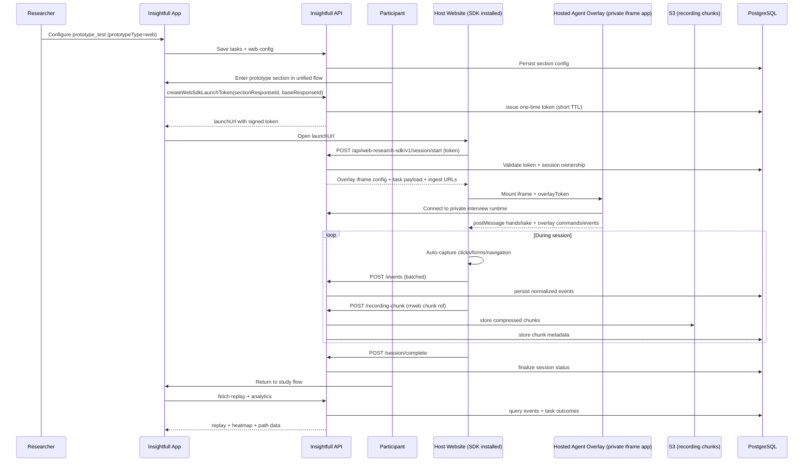
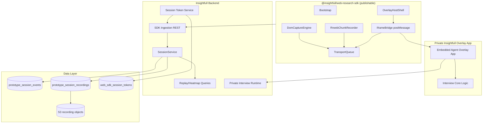

# Technical Design Document: Live Website Research SDK (`@insightfull/web-research-sdk`)

| Metadata      | Details                                |
| :------------ | :------------------------------------- |
| **Author**    | Engineering                            |
| **Status**    | Draft                                  |
| **Created**   | 2026-03-29                             |
| **Reviewers** | Product, Staff Frontend, Staff Backend |

---

## 1. Context & Problem Statement

### Problem Description

Insightfull’s current prototype testing experience is strong for Figma imports, but we still have a major gap for **live website/app testing**.

Today, a researcher can test static or imported prototype flows, but cannot reliably run task-based studies on a real web app while capturing:

1. Automatic UI behavior telemetry (button presses, input changes, form submissions, route transitions)
2. Session replay-quality context
3. AI-moderated participant guidance in the same experience
4. A path to triggered in-product surveys on the same runtime

The previous prototype TDD already identified this gap and deferred it as “Phase 2 web prototype testing” with a proxy+SDK approach (`docs/tdd/tdd_prototype_testing.md`). This document now breaks that work into a dedicated, execution-ready TDD centered on a publishable SDK.

#### User Scenario

Imagine a PM testing a live checkout flow in their staging app:

- They want participants to complete tasks (“upgrade plan”, “apply coupon”, “change payment method”)
- They want an AI-guided overlay like our existing `AgentSessionOverlay` participant experience
- They need automatic behavioral evidence (not manual self-report)
- They also want to eventually trigger short surveys contextually in-app without standing up a separate tool

Without this, teams either:

- Use separate tools (Sprig/Hotjar/others) and lose unified analysis, or
- Run manually-moderated sessions with poor scale and weak comparability.

### Competitive Baseline (Public Market Scan)

Based on Sprig’s public product pages and comparison pages (web/apps, replays, heatmaps, in-product surveys), the baseline expectation in this category is:

- Triggered in-product studies by user behavior + attributes
- Session replays + heatmaps
- AI summaries over behavioral/survey data
- Lightweight SDK install and broad integrations

This is table-stakes behavior tooling. Insightfull’s 10x opportunity is to combine this with our core strengths:

- AI-moderated research sessions (not just passive tracking)
- Multi-method synthesis across interviews, prototype/live behavior, and surveys
- Decision outputs (research-grade recommendations and downstream PRD/roadmap context), not only dashboards

### Goals & Business Value

#### Primary Goals (MVP)

1. **Publish a reusable web SDK** (`@insightfull/web-research-sdk`) for live website prototype testing.
2. **Deliver an AgentSessionOverlay-like participant experience** (draggable AI overlay with moderation controls) for live website tasks.
3. **Automatically capture core UI interactions** (button/link clicks, input changes, form submits, navigation transitions) with privacy-safe metadata.
4. **Unify data into existing prototype testing analysis** (replay + heatmap + navigation + task outcomes) within Insightfull.
5. **Use one study flow**: participants should not feel like they are moving across disconnected products.

#### Secondary Goals (Phase 2)

6. Add trigger-driven in-app survey delivery using the same SDK runtime.
7. Reuse event stream + identity context for survey targeting and frequency controls.

#### Business Value

- Expands Insightfull from design-prototype testing to real-product experience validation.
- Increases response quality through in-context behavioral evidence.
- Improves conversion from “study created” → “actionable insights” by reducing external tooling handoffs.
- Creates a strategic wedge vs standalone behavior tools: agent-moderated behavior + synthesis in one platform.

### Non-Goals (Out of Scope)

1. **Native mobile SDK delivery in MVP** (iOS/Android/React Native deferred).
2. **Proxy-only “magic embed everything” path in MVP** (SDK-first for reliability).
3. **Full visual no-code event instrumentation builder in MVP**.
4. **Always-on full-session recording for all traffic** (MVP remains targeted study/session scoped).
5. **Replacing existing Figma prototype flow** (this is additive, not a rewrite).

---

## 2. Success Metrics (Definition of Done)

### Technical Metrics

- **SDK startup latency**: p95 < 300ms from initialization call to “capture ready” state.
- **Event delivery reliability**: >= 99% of click/navigation/form events persisted for completed sessions.
- **Ingestion latency**: p95 < 2s from client send to persistence.
- **Overlay readiness**: Agent overlay visible and interactive < 1.5s after session start.
- **Replay availability**: completed session replay load p95 < 2s.
- **API reliability**: public SDK ingestion endpoints 99.9% availability.
- **Install verification speed**: median < 10 minutes from SDK install to first successful `session/start` in diagnostics.
- **Integration effort**: design partner teams can complete baseline integration in < 30 minutes using official quickstart path.
- **Payload quality**: duplicate event rate from retries < 0.5% (enforced via idempotency keys).

### Business Metrics

- **Adoption**: at least 10 orgs launch a live-website prototype test within 8 weeks of rollout.
- **Completion quality**: >= 85% of live-website sessions include at least one task completion or explicit abandonment signal.
- **Insight utility**: >= 60% of studies using live website testing produce at least one behavior-backed actionable finding.
- **Tool consolidation**: measure % of orgs using external replay tool + Insightfull before/after launch; target measurable reduction.
- **Time-to-first-study**: 80% of onboarded design partner orgs complete first web study setup within 1 business day.

### Internal Dashboard & Visibility

- **Metabase Dashboard Prompt**:
  Build a dashboard in the `product` collection named **“Live Website Research SDK Funnel & Quality”** with filters: org, study, date range, feature flag cohort, prototype type (`figma|web`), SDK version, install mode (`script_tag|npm|manual`), browser family. Include cards for:
  1. Launch funnel: `study_created -> web_sdk_configured -> first_session_started -> first_session_completed`
  2. Integration funnel: `install_check_started -> install_check_passed -> session_start_success`
  3. Session quality: avg events/session, % with task_start, % with task_complete, % abandoned
  4. Reliability: session start failure rate, event batch failure rate, retry success rate, idempotency dedupe rate, 429/5xx by endpoint
  5. Time metrics: session start latency, ingestion latency, replay generation latency
  6. Behavioral quality: dead-click ratio, form-submit success ratio, navigation loop rate
  7. AI moderation engagement: overlay shown rate, prompt delivered rate, mic-toggle usage, end-session reasons
  8. Security/privacy health: origin mismatch volume, consent-blocked volume, redaction applied rate
  9. Cohort comparison: live-website sessions with overlay enabled vs disabled (completion + drop-off)
     Owners: Product Analytics + Prototype Testing squad.

---

## 3. High-Level Architecture

### System Diagram





### Key Components

- **Frontend / SDK**
  - New publishable package: `@insightfull/web-research-sdk`
  - `OverlayHostShell` handles overlay container placement, drag/minimize behavior, and host-page safety
  - `IframeBridge` manages secure postMessage communication with the hosted private overlay app
  - DOM instrumentation engine for automatic interaction capture
  - Batching + retry queue with `sendBeacon` fallback

- **Frontend / Private Overlay App (Insightfull-owned)**
  - Hosted embedded app rendered in iframe
  - Contains interview/agent orchestration UI and proprietary moderation experience
  - Communicates with SDK through versioned message protocol

- **Frontend / Insightfull App**
  - Extend prototype section flow to support `prototypeType="web"`
  - Token issuance + launch handoff UX
  - Existing replay/analysis surfaces consume web session data

- **Backend**
  - Public REST ingestion surface for SDK runtime
  - Token issuance and verification service
  - Overlay token issuance + validation service for iframe app
  - Extension of `SessionService`/repositories for web event and recording metadata
  - Idempotency receipt service for retry-safe ingestion
  - Optional async ingest buffering path when DB pressure exceeds threshold
  - Private interview runtime APIs used by hosted overlay app

- **Infrastructure**
  - Existing Postgres + S3 reused
  - Optional CDN delivery path for package assets (future); npm package publish is required
  - Datadog monitors + dashboard for ingestion reliability
  - Optional first-party reverse-proxy endpoint support for blocker-sensitive environments

---

## 4. Detailed Design

### 4.1 Data Models & Storage (Critical)

#### Schema Changes

We extend existing prototype event storage rather than creating a separate behavior silo.

```ts
// db/schema.ts (additive)

export const webSdkSessionTokens = pgTable(
  "web_sdk_session_tokens",
  {
    id: uuid("id").defaultRandom().primaryKey(),
    launchTokenHash: text("launch_token_hash").notNull().unique(),
    sectionResponseId: integer("section_response_id")
      .notNull()
      .references(() => sectionResponses.id, { onDelete: "cascade" }),
    baseResponseId: integer("base_response_id")
      .notNull()
      .references(() => studyResponsesBase.id, { onDelete: "cascade" }),
    organizationId: integer("organization_id")
      .notNull()
      .references(() => organizations.id),
    // Supports multi-origin apps: app.example.com, www.example.com, staging domains
    allowedOrigins: jsonb("allowed_origins").$type<string[]>().notNull(),
    // Optional wildcard patterns for enterprise environments (e.g. *.staging.example.com)
    allowedOriginPatterns: jsonb("allowed_origin_patterns").$type<string[]>().default([]).notNull(),
    sdkMode: text("sdk_mode").$type<"script_tag" | "npm" | "manual">().notNull(),
    expiresAt: timestamp("expires_at").notNull(),
    consumedAt: timestamp("consumed_at"),
    revokedAt: timestamp("revoked_at"),
    createdAt: timestamp("created_at").defaultNow().notNull(),
  },
  (t) => [
    index("web_sdk_tokens_section_response_idx").on(t.sectionResponseId),
    index("web_sdk_tokens_expires_idx").on(t.expiresAt),
    index("web_sdk_tokens_org_idx").on(t.organizationId),
  ],
);

// Idempotency receipts for retry-safe ingestion across events/chunks/session-complete
export const browserTrackerIngestReceipts = pgTable(
  "browser_tracker_ingest_receipts",
  {
    id: serial("id").primaryKey(),
    sectionResponseId: integer("section_response_id")
      .notNull()
      .references(() => sectionResponses.id, { onDelete: "cascade" }),
    endpoint: text("endpoint").$type<"events" | "recording_chunk" | "session_complete">().notNull(),
    idempotencyKey: text("idempotency_key").notNull(),
    requestHash: text("request_hash").notNull(),
    responseCode: integer("response_code").notNull(),
    createdAt: timestamp("created_at").defaultNow().notNull(),
  },
  (t) => [
    uniqueIndex("browser_tracker_ingest_receipts_unique").on(
      t.sectionResponseId,
      t.endpoint,
      t.idempotencyKey,
    ),
  ],
);

// Extend existing table
export const prototypeSessionEvents = pgTable(
  "prototype_session_events",
  {
    // ...existing fields
    source: text("source").$type<"figma_player" | "web_sdk">().notNull().default("figma_player"),
    pageUrl: text("page_url"),
    pagePath: text("page_path"),
    selectorHash: text("selector_hash"),
    elementTag: text("element_tag"),
    elementRole: text("element_role"),
    domEventName: text("dom_event_name"),
    inputType: text("input_type"),
    isTrusted: boolean("is_trusted"),
  },
  (t) => [
    // ...existing indexes
    index("proto_events_web_path_idx").on(t.studyId, t.pagePath, t.eventType),
    index("proto_events_selector_idx").on(t.studyId, t.selectorHash, t.eventType),
  ],
);

export const prototypeSessionRecordings = pgTable(
  "prototype_session_recordings",
  {
    id: serial("id").primaryKey(),
    sectionResponseId: integer("section_response_id")
      .notNull()
      .references(() => sectionResponses.id, { onDelete: "cascade" }),
    source: text("source").$type<"figma_player" | "web_sdk">().notNull(),
    recordingObjectKey: text("recording_object_key").notNull(),
    eventCount: integer("event_count").notNull().default(0),
    startedAt: timestamp("started_at").notNull(),
    endedAt: timestamp("ended_at"),
    createdAt: timestamp("created_at").defaultNow().notNull(),
  },
  (t) => [index("proto_recordings_section_response_idx").on(t.sectionResponseId)],
);
```

#### Section Config Shape (prototypeType = web)

`PrototypeTestSectionConfig` gains a `web` block for live sessions (keeping existing Figma config intact):

```ts
web: {
  mode: "sdk"; // MVP
  startUrl: string;
  allowedOrigins: string[]; // exact allowlist
  allowedOriginPatterns?: string[]; // optional wildcard patterns for enterprise/staging
  integration: {
    installMode: "script_tag" | "npm" | "manual";
    bootstrapMode: "launch_token_fragment" | "manual_start";
    frameworkHint?: "nextjs" | "react_spa" | "vue_spa" | "angular" | "plain_html";
  };
  completion: {
    returnUrl: string;
    successUrlPatterns?: string[];
    maxSessionMinutes: number;
  };
  capture: {
    recordInputValues: false; // default false
    recordDomText: false; // default false (sensitive content must be redacted)
    redactSelectors: string[]; // required defaults include passwords/payment inputs
    redactAttributeKeys: string[]; // e.g. data-email, aria-label patterns containing PII
    sampleRates?: {
      mousemove: number; // 0..1
      scroll: number; // 0..1
    };
  };
  consent: {
    mode: "required" | "best_effort" | "off";
    requiredSignalName?: string; // e.g. "research_capture_consent_granted"
  };
  overlay: {
    enabled: true;
    showAiPersona: boolean;
    defaultPosition: "bottom-right" | "bottom-left";
  };
}
```

Token transport rule for launch URLs:

- Use URL fragment (`#iftk=<token>`) for launch token transport to reduce leakage via `Referer` and server logs.
- SDK consumes token immediately, exchanges it for session credentials, and then clears fragment via `history.replaceState`.

#### Growth & Retention

- `prototype_session_events` can grow quickly for web sessions.
- Retention policy:
  - High-value events (`click`, `navigation`, `task_*`, `form_submit`): 365 days
  - High-volume events (`mousemove`, `scroll`): 30 days (or sampled)
- If volume exceeds target thresholds, partition `prototype_session_events` monthly by `created_at`.

#### Migration Plan

1. Additive Drizzle migration for new table + columns + indexes.
2. Existing rows default to `source='figma_player'`; no custom backfill task required.
3. Deploy behind flag before enabling token issuance.

### 4.2 API Specifications

Two API surfaces:

1. **Internal tRPC (Insightfull app only)** for section configuration and token handoff
2. **Public REST (SDK runtime)** for cross-origin ingestion from customer websites

#### Internal tRPC

- `prototypeTest.createWebSdkLaunchToken`
  - Input: `{ sectionResponseId: number; baseResponseId: number; sectionId: number }`
  - Output: `{ launchUrl: string; expiresAt: string }`
- `prototypeTest.getWebSdkDiagnostics`
  - Input: `{ sectionId: number }`
  - Output: latest start/session errors + install verification hints

#### Public REST

All SDK endpoints are versioned under `/api/web-research-sdk/v1/*` and support CORS only for validated origins.

##### Transport Contract (all write endpoints)

- `X-Insightfull-SDK-Version`: required for all requests.
- `X-Insightfull-Session-Id`: required after `session/start`.
- `X-Insightfull-Idempotency-Key`: required for `events`, `recording-chunk`, and `session/complete`.
- Idempotency keys are deduped per `(sectionResponseId, endpoint, idempotencyKey)` via `browser_tracker_ingest_receipts`.

##### `POST /api/web-research-sdk/v1/session/start`

- **Input**
  ```ts
  {
    token: string;
    sdkVersion: string;
    origin: string;
    page: { url: string; path: string; referrer?: string };
    tokenSource: "fragment" | "manual";
    env: { userAgent: string; viewport: { width: number; height: number } };
  }
  ```
- **Output**
  ```ts
  {
    sessionId: string;
    sessionToken: string; // short-lived session credential replacing launch token
    sessionExpiresAt: string;
    ingest: {
      eventsUrl: string;
      recordingUrl: string;
      completeUrl: string;
      heartbeatUrl: string;
    };
    overlay: {
      mode: "iframe";
      enabled: boolean;
      iframeSrc: string;
      iframeOrigin: string;
      overlayToken: string; // short-lived token for private overlay runtime
      protocolVersion: "1.0";
      capabilities: Array<
        | "agent_audio"
        | "agent_video"
        | "pointer_passthrough"
        | "task_prompts"
      >;
      showAiPersona: boolean;
      defaultPosition: "bottom-right" | "bottom-left";
    };
    tasks: Array<{ id: string; instruction: string; maxDurationSeconds?: number }>;
    privacy: {
      redactSelectors: string[];
      redactAttributeKeys: string[];
      recordInputValues: boolean;
      recordDomText: boolean;
    };
    consent: { mode: "required" | "best_effort" | "off"; captureAllowed: boolean };
    diagnostics: {
      installMode: "script_tag" | "npm" | "manual";
      originMatchedBy: "exact" | "pattern";
    };
  }
  ```

##### `POST /api/web-research-sdk/v1/events`

- **Input**: batched normalized event payload (max 200), with `idempotencyKey` header
- **Output**: `{ inserted: number; deduped: boolean; acceptedAt: string }`

##### `POST /api/web-research-sdk/v1/recording-chunk`

- **Input**: compressed chunk + session metadata + monotonic `chunkSequence`
- **Output**: `{ chunkId: string; deduped: boolean; stored: true }`

##### `POST /api/web-research-sdk/v1/session/heartbeat`

- **Input**: session health + current URL/path + queue depth
- **Output**: `{ status: "ok" | "expiring" | "closed"; retryAfterMs?: number }`

##### `POST /api/web-research-sdk/v1/session/complete`

- **Input**: completion reason + optional summary metrics + `idempotencyKey`
- **Output**: `{ status: "completed" | "abandoned"; deduped: boolean }`

##### `POST /api/web-research-sdk/v1/install/check`

- **Input**: origin, sdkVersion, installMode
- **Output**: pass/fail diagnostics for CORS, CSP reachability, and endpoint connectivity.
- Used by “10-minute verify” onboarding flow.

#### Error Handling

| Code | Condition                            | Client Behavior                          |
| :--- | :----------------------------------- | :--------------------------------------- |
| 400  | Invalid payload/schema               | Drop batch; emit SDK error event         |
| 401  | Invalid/expired token/session        | Stop session, show “Session expired” UI  |
| 403  | Origin mismatch / org mismatch       | Stop capture, show security error        |
| 404  | Session/section not found            | Stop capture                             |
| 409  | Token already consumed/replayed      | Block duplicate start                    |
| 410  | Session closed                       | Stop further sends                       |
| 412  | Consent required but missing         | Pause capture, prompt consent UX         |
| 422  | Idempotency key malformed/reused bad | Reject request; request new key          |
| 429  | Rate limit hit                       | Retry with backoff, preserve local queue |
| 500  | Server error                         | Retry with capped exponential backoff    |

#### Idempotency & Retry Semantics

- SDK generates deterministic idempotency keys per payload flush attempt (`sessionId + endpoint + sequence + payloadHash`).
- Server behavior:
  - first valid key: process request and persist receipt
  - repeated key with same `requestHash`: return previous result with `deduped=true`
  - repeated key with different `requestHash`: reject with `422`
- Receipt retention: 7 days (sufficient for retries and incident debugging).
- Analytics reads dedupe-aware aggregates to avoid retry-driven inflation.

### 4.3 Security & Privacy (MUST HAVE)

#### Authentication / Authorization

- One-time short-lived **launch token** for SDK bootstrap (`web_sdk_session_tokens`).
- Token is persisted and matched by **hash only** (`launchTokenHash`) to avoid accidental plaintext disclosure in logs.
- Token is bound to:
  - `sectionResponseId`
  - `baseResponseId`
  - `organizationId`
  - `allowedOrigins`/`allowedOriginPatterns`
- Launch token is exchanged at `session/start` for a short-lived **session token** used on subsequent writes.
- Server verifies session ownership + org consistency on every ingest write to prevent IDOR/cross-org leakage.

#### Origin Validation & Redirect Safety

- Exact origin matching is preferred; pattern matching is allowed only when configured (`*.staging.example.com`).
- Matching algorithm normalizes scheme + host + port before comparison.
- Supports common multi-origin flows (marketing domain -> app subdomain -> auth callback) only when all origins are explicitly/pattern allowlisted.
- If participant is redirected to an untrusted origin, SDK terminates capture and reports `origin_mismatch`.

#### Token Leakage Mitigation

- Launch token must be transported via URL fragment (`#iftk=`), not query param, whenever possible.
- SDK clears token fragment immediately after successful `session/start` exchange via `history.replaceState`.
- Backend and SDK must redact token-like strings from logs.
- Referrer policy for launch pages should be `strict-origin-when-cross-origin` or stricter.

#### Overlay Iframe Boundary & Message Security

- Rich interview logic is **not** shipped in OSS SDK; it runs in a private hosted iframe app.
- SDK and iframe communicate only through versioned `postMessage` contracts.
- Message validation requirements:
  - strict `targetOrigin` usage (no wildcard `*` in production)
  - validate `origin` and `protocolVersion` on every received message
  - runtime schema validation for payloads
  - ignore unknown/unsupported commands by default
- Overlay token is scoped only to overlay runtime actions and cannot be used for event ingestion writes.
- SDK must support immediate iframe teardown + session pause on repeated protocol/auth failures.

#### PII & Data Compliance

- Default behavior: **do not capture raw input values**.
- Always redact:
  - `input[type=password]`
  - common payment fields
  - selectors in denylist
- DOM text capture is off by default; if enabled, apply redaction first and hash sensitive text fragments.
- Attribute redaction denylist applies to custom attributes and ARIA labels likely to include PII.
- Store only hashed/normalized selector metadata where possible.
- Session recording data (rrweb chunks) stored encrypted at rest in S3.
- Consent handling modes:
  - `required`: no capture until consent signal is present
  - `best_effort`: capture starts, but marks consent status and can suppress recording chunk upload
  - `off`: controlled only for approved internal/testing contexts
- Hard delete of study response must cascade or cleanup:
  - event rows
  - recording metadata
  - recording objects
  - issued session tokens

#### CSP, Script Delivery, and Enterprise Security Controls

- SDK supports both first-party bundle (npm/self-host) and Insightfull-hosted script delivery.
- Provide CSP guidance for both modes:
  - Required `connect-src` endpoints for ingest APIs
  - `script-src` nonce/hash/SRI guidance for hosted script
  - No `unsafe-eval` requirement
- Example CSP baseline (hosted script mode):

  ```txt
  Content-Security-Policy:
    script-src 'self' https://cdn.insightfull.ai 'nonce-<server-generated>';
    connect-src 'self' https://api.insightfull.ai;
    img-src 'self' data: blob:;
    worker-src 'self' blob:;
    media-src 'self' blob:;
  ```

- Example CSP baseline (npm/self-host mode):

  ```txt
  Content-Security-Policy:
    script-src 'self';
    connect-src 'self' https://api.insightfull.ai;
    img-src 'self' data: blob:;
    worker-src 'self' blob:;
    media-src 'self' blob:;
  ```

- Enterprise control options:
  - org-level kill switch
  - per-study disable switch
  - capture mode restrictions enforced server-side

#### Ad Blockers / Network Filtering

- Offer configurable endpoint base path for customer reverse-proxying under first-party domain.
- SDK reports `network_blocked` diagnostic when endpoints are likely blocked by extensions or corporate filtering.
- `install/check` endpoint verifies reachability during setup.

#### Rate Limiting

- Per-token and per-IP limits on SDK endpoints.
- WAF guardrails for abuse spikes.
- Server-side batch size constraints and payload size limits.
- Anomaly monitoring for replay attempts, geographic/IP shifts on a single token, and excessive token failures.

### 4.4 Frontend Architecture (Staff-Level Detail)

#### Component Design & Data Flow

#### SDK Runtime Modules (`@insightfull/web-research-sdk`)

1. `createBrowserTracker()` — public bootstrap API
2. `SessionBootstrapClient` — start/heartbeat/complete calls
3. `DomCaptureEngine` — auto-captures click/input/submit/navigation
4. `RecordingChunkRecorder` — replay chunk generation + upload
5. `OverlayHostShell` — host-page overlay container (drag/minimize/layout/safety)
6. `IframeBridge` — secure postMessage bridge to private hosted overlay app
7. `TransportQueue` — batching/retry/sendBeacon fallback
8. `InstanceGuard` — prevents duplicate initialization in microfrontend/multi-bundle hosts
9. `ConsentGate` — runtime gate honoring consent mode in section config

#### Integration Modes (all supported in MVP)

1. **Script-tag mode (fastest path)**
   - Global API: `window.InsightfullBrowserTracker.init(...)`
   - Works for plain HTML, legacy stacks, GTM-based setups.
   - Reference bootstrap:

     ```html
     <script async src="https://cdn.insightfull.ai/web-research-sdk/v1.js"></script>
     <script>
       window.InsightfullBrowserTracker.init({
         mode: "auto",
         launchTokenSource: "fragment",
       });
     </script>
     ```

2. **NPM mode (typed integration)**
   - `import { initBrowserTracker } from "@insightfull/web-research-sdk"`
   - SSR-safe import behavior (no `window` access at import time).
   - Reference bootstrap:

     ```ts
     import { initBrowserTracker } from "@insightfull/web-research-sdk";

     initBrowserTracker({
       mode: "auto",
       launchTokenSource: "fragment",
     });
     ```

3. **Auto-bootstrap launch mode**
   - Reads launch token from URL fragment and starts session with minimal host code.

4. **Manual lifecycle mode (escape hatch)**
   - Explicit APIs for complex auth/navigation flows:
     - `startSession(token)`
     - `setParticipantContext(...)`
     - `flushAndPause()`
     - `endSession(reason)`

#### Framework Compatibility Requirements

- Must ship examples for:
  - Next.js App Router (SSR + client transitions)
  - React SPA (React Router)
  - Vue SPA (Vue Router)
  - Plain HTML script embed
- SPA navigation capture must support:
  - `history.pushState`
  - `history.replaceState`
  - `popstate`
  - hash-based routers
- BFCache-safe listener lifecycle:
  - attach once per page lifecycle
  - rehydrate safely on `pageshow` (`event.persisted`)

#### 10-Minute Install Verification Flow

1. Integrator installs SDK via script-tag or npm.
2. Run `install/check` from host origin to validate CORS/CSP reachability.
3. Launch a test participant session and confirm `session/start` success.
4. Perform one click and one navigation; verify events arrive in diagnostics.
5. Confirm replay chunk upload and end-session completion status.
6. If any step fails, return explicit diagnostic code + action link in docs.

#### Overlay MVP Requirements (Host Shell + Private Iframe)

- Draggable floating panel
- Minimize / expand behavior
- Mic toggle and camera toggle controls (rendered by private iframe app; SDK host shell relays commands/state)
- Optional AI persona + latest prompt strip (private iframe app)
- End-session action with reason capture
- Pointer pass-through mode for host page interaction where needed

The UX should feel familiar to existing prototype participants while being framework-agnostic on host websites. The SDK controls container behavior; interview logic and rich moderation behavior live in the private iframe app.

#### Insightfull App Integration

- Reuse `prototype_test` section type with `prototypeType="web"`
- Existing `PrototypeTestSection` flow dispatches launch token and transitions participant to host URL
- On return, replay and analytics use the same analysis surface as Figma prototype mode

#### Data Fetching & Caching Strategy

- Session bootstrap is mutation-like (no long cache)
- Event queue flush every N seconds or N events
- Local queue persisted in `indexedDB` for transient network failures
- Retry policy: exponential backoff with jitter; max retry horizon 2 minutes
- Queue backpressure and safety:
  - max queue bytes limit with priority eviction (`mousemove`/`scroll` first)
  - crash-safe periodic snapshots for long sessions
- Flush lifecycle hooks:
  - `visibilitychange` and `pagehide` first
  - `beforeunload` best-effort fallback
- Idempotency key per flush batch/chunk/complete mutation

#### UX & Error Handling

- If SDK is missing or bootstrap fails: show participant-safe fallback with return-to-study CTA
- If network drops: continue local buffering, badge overlay with reconnect state
- If token expires mid-session: graceful stop + preserve buffered events + return guidance
- If consent is required and missing: show consent-blocked state and do not start capture.
- If origin mismatch occurs: non-recoverable security state with clear participant messaging.
- If ad-blocker/corporate filtering detected: show diagnostics code and fallback instructions.

#### Performance Budget

- SDK bundle targets:
  - base capture runtime <= 45kb gzipped
  - overlay module lazy-loaded
  - replay recorder lazy-loaded on first session start
- Runtime overhead targets:
  - <= 2% CPU on median desktop baseline during passive interaction
  - event processing time p95 < 8ms per captured interaction

#### Analytics & Observability

Emit client and server telemetry for:

- `browser_sdk.session_start.requested|succeeded|failed`
- `browser_sdk.events.flush.succeeded|failed`
- `browser_sdk.recording.chunk_uploaded|failed`
- `browser_sdk.overlay.minimized|expanded|ended`
- `browser_sdk.privacy.redaction_applied`
- `browser_sdk.install_check.succeeded|failed`
- `browser_sdk.origin_validation.failed`
- `browser_sdk.consent_blocked`

### 4.5 Overlay Integration Boundary (SDK vs Private Interview Core)

Canonical bridge contract reference:

- `/home/user/web-research-sdk/docs/plans/overlay-bridge-protocol-v1.md`
- `https://github.com/insightfullai/web-research-sdk/blob/main/docs/plans/overlay-bridge-protocol-v1.md`

This boundary is intentional and critical to product strategy:

- **Open-source SDK (`@insightfull/web-research-sdk`) owns:**
  - overlay host container (positioning, drag/minimize, safe z-indexing)
  - iframe lifecycle and mount/unmount
  - secure bridge transport (`postMessage`) and protocol validation
  - participant/session context events sent to overlay app

- **Private Insightfull overlay app owns:**
  - interview core logic, prompt orchestration, persona behavior
  - real-time agent audio/video and moderation intelligence
  - proprietary UI/interaction logic for the core research experience

#### Bridge Protocol (v1)

- Handshake:
  1. SDK mounts iframe from trusted `iframeOrigin` + `iframeSrc`
  2. SDK sends `overlay:init` with `sessionId`, capabilities, and protocol version
  3. iframe replies `overlay:ready`
- SDK → iframe messages:
  - `overlay:init`
  - `overlay:task_update`
  - `overlay:navigation_context`
  - `overlay:session_state`
- iframe → SDK messages:
  - `overlay:ready`
  - `overlay:ui_command` (e.g., `set_pointer_passthrough`, `request_minimize`)
  - `overlay:session_action` (e.g., `end_session`)
  - `overlay:diagnostic`

#### Non-goal clarity

- We are **not** open-sourcing interview core logic in this SDK repo.
- The SDK provides a stable integration seam so private interview capabilities can evolve independently.

---

## 5. Failure Modes & Resilience

### Failure Scenarios

1. **Database slowdown during event spikes**
   - Symptom: ingest latency and 5xx rise
   - Mitigation: batch inserts, queue backpressure, selective sampling for high-volume event types, optional async ingest buffering mode

2. **Host page CSP or script blockers prevent SDK boot**
   - Symptom: no session start callbacks
   - Mitigation: preflight diagnostics endpoint + clear researcher instructions + fallback return path

3. **Token replay / malicious reuse**
   - Symptom: repeated start attempts from different origins
   - Mitigation: one-time token consumption + strict origin validation + audit logs

4. **Network instability mid-session**
   - Symptom: missing final events
   - Mitigation: local queue + periodic flush + `pagehide`/`visibilitychange` flush + `sendBeacon` fallback

5. **Recording upload failure with events still flowing**
   - Symptom: replay incomplete but event analytics available
   - Mitigation: partial degradation (analysis still works), surfaced warning in researcher UI

6. **Token leakage in query/referrer/logs**
   - Symptom: unauthorized attempts using copied tokens
   - Mitigation: fragment transport, hash-at-rest token storage, log scrubbing, short TTL, one-time consume

7. **SPA route instrumentation misses transitions**
   - Symptom: events show stale `pagePath` and broken path analytics
   - Mitigation: instrument `pushState`/`replaceState`/`popstate` and hash-change routers

8. **BFCache restore causes duplicate listeners**
   - Symptom: duplicate events and inflated click counts
   - Mitigation: instance guard + listener idempotency + `pageshow` rehydrate logic

9. **Ad blocker/corporate proxy blocks ingest endpoints**
   - Symptom: repeated network failures despite healthy internet
   - Mitigation: first-party proxy endpoint option + setup diagnostics + explicit blocked-endpoint error codes

10. **Multi-origin auth redirects invalidate sessions unexpectedly**
    - Symptom: session starts on origin A, fails on origin B callback
    - Mitigation: allowlist all redirect origins + pattern support where approved + heartbeat origin checks

11. **Idempotency collisions or missing keys under retries**
    - Symptom: duplicate or dropped batches
    - Mitigation: strict idempotency key contract + ingest receipts table + deterministic retry key generation

12. **Hosted overlay iframe unavailable or blocked**
    - Symptom: participant sees host page capture but no moderated overlay experience
    - Mitigation: SDK enters degraded mode with clear participant messaging, keeps behavior capture alive, and emits `overlay_unavailable` diagnostics for researcher triage

### Recovery Strategy

- Retries with exponential backoff for transient network errors
- Distinct dead-letter handling for recording chunks that repeatedly fail
- Feature-gated kill switch to disable session start and preserve core study flows
- Emergency degrade mode: disable replay chunk ingestion while keeping core event ingestion active
- Automatic sampling increase for high-volume event types under pressure (mousemove/scroll)
- Runbook-driven incident triage with error-code mapping and known mitigations

### Debugging & Diagnostics

- Internal diagnostics page for SDK sessions:
  - token issuance/consumption timeline
  - ingest error codes
  - last successful batch timestamp
  - recording object links/status
  - current origin + allowlist match reason (exact/pattern)
  - consent mode/status at session start
  - ad-blocker/network filtering signal
- Structured logs with request IDs + `sectionResponseId` + `studyId` + `organizationId`
- Support runbook mapping common symptoms to fixes:
  - “No events captured”
  - “Overlay not visible”
  - “Session ended unexpectedly”
  - “Origin mismatch after auth redirect”
  - “Duplicate events after tab restore”

---

## 6. Documentation Requirements

### Technical Documentation

| Document                               | Audience                           | Status         | Owner |
| :------------------------------------- | :--------------------------------- | :------------- | :---- |
| **API Documentation**                  | SDK integrators / internal backend | 🟡 Review      | Eng   |
| **Runbook**                            | On-call Engineering                | 🟢 Draft       | Eng   |
| **Architecture Decision Record (ADR)** | Future engineers                   | 🟢 Draft       | Eng   |
| **SDK Integration Guide**              | Customer developers                | 🔴 Not Started | Eng   |
| **Fast Install Pack**                  | Customer developers / Solutions    | 🔴 Not Started | Eng   |

### Runbook Content Checklist

- [x] **Feature Overview**: Live website prototype sessions via SDK with agent overlay and behavioral capture.
- [x] **Architecture Diagram**: SDK runtime + ingestion + storage + analysis flow.
- [x] **Common Issues & Fixes**: token failures, CSP issues, ingest retries, replay partials, rate limits.
- [x] **Dashboard Links**: product funnel dashboard + engineering reliability dashboard.
- [x] **Rollback Procedure**: disable feature flag + reject new token issuance.
- [x] **Contact Information**: Prototype testing squad + on-call owner.

### Code Documentation

| Type                 | Requirement                                                                | Location                            |
| :------------------- | :------------------------------------------------------------------------- | :---------------------------------- |
| **Comments**         | Document capture normalization + selector hashing + event sampling rules   | `libs/web-research-sdk/*`           |
| **README**           | New publishable package setup, API, privacy behavior, compatibility matrix | `libs/web-research-sdk/README.md`   |
| **Type Definitions** | JSDoc on shared event schemas and token/session contracts                  | `libs/web-research-sdk/src/types/*` |

### Customer-Facing Documentation

- [ ] Help Center Articles:
  - “Run live website prototype tests with Insightfull SDK”
  - “Privacy controls and data masking for live sessions”
  - “Troubleshooting SDK installation and CSP setup”
  - “CSP and security review checklist for enterprise installs”
- [ ] In-Product Tooltips/Guidance:
  - Web prototype section setup checklist
  - Token launch diagnostics hints
- [ ] API Documentation:
  - Public SDK runtime endpoints (`/api/web-research-sdk/v1/*`)
- [ ] Fast Install Pack Contents:
  - 10-minute quickstart (script-tag + npm)
  - Next.js / React SPA / Vue SPA snippets
  - CSP copy-paste policy examples
  - install verification steps (`/install/check`)
  - troubleshooting decision tree for top 10 integration errors

---

## 7. Implementation & Execution

### 7.1 Breaking Changes & Dependencies

- **Breaking Changes**: None required for current participant flows; this is additive under `prototypeType="web"`.
- **Dependencies**:
  - Legal/privacy review for capture defaults and disclosure copy
  - Product/Design sign-off on overlay behavior and interruption model
  - DevEx agreement on npm package publish workflow
  - Security review for token transport, CSP guidance, and origin/pattern matching policy
  - Solutions/Customer Engineering input on fast-install docs and setup friction

### 7.2 Milestones & Phases

Execution model: parallelizable by domain (SDK runtime, backend ingestion, participant flow integration, analytics/replay).

#### Milestone 1 — Contracts, Schema, and Token Lifecycle

- **Phase 1A**: Extend `PrototypeTestSectionConfig` with `web` config block + validation.
- **Phase 1B**: Add DB schema (`web_sdk_session_tokens`, event table extension, recordings table).
- **Phase 1C**: Implement token issuance/verification service + tests.
- **Phase 1D**: Implement origin allowlist + pattern matching rules and token hash-at-rest policy.

#### Milestone 2 — Public SDK Ingestion Surface

- **Phase 2A**: Add REST endpoints for start/events/recording/complete.
- **Phase 2B**: Wire endpoints to `SessionService` + repository extensions.
- **Phase 2C**: Add idempotency key enforcement + `browser_tracker_ingest_receipts` dedupe.
- **Phase 2D**: Add install diagnostics endpoint (`/install/check`) + CORS validation telemetry.
- **Phase 2E**: Add Datadog metrics/logging + error taxonomy.

#### Milestone 3 — Publishable SDK Core (`@insightfull/web-research-sdk`)

- **Phase 3A**: Build framework-agnostic bootstrap and transport queue.
- **Phase 3B**: Implement `DomCaptureEngine` for click/input/submit/navigation.
- **Phase 3C**: Implement replay chunk recorder + upload pipeline.
- **Phase 3D**: Implement all integration modes (script-tag, npm, auto-bootstrap, manual lifecycle).
- **Phase 3E**: Add framework adapters/examples (Next.js, React SPA, Vue SPA, plain HTML).
- **Phase 3F**: Implement iframe bridge protocol package and schema validation contracts.
- **Phase 3G**: Package + versioning + npm publish CI flow.

#### Milestone 4 — Overlay UX & Participant Flow Integration

- **Phase 4A**: Implement `OverlayHostShell` with MVP parity to existing `AgentSessionOverlay` container interaction model.
- **Phase 4B**: Integrate launch token flow in prototype section runtime.
- **Phase 4C**: Ensure return-to-study and partial failure handling UX.
- **Phase 4D**: Integrate consent gate behavior and blocked-state UX (`consent_required`, `origin_mismatch`, `network_blocked`).
- **Phase 4E**: Integrate hosted private iframe overlay with protocol handshake and degraded fallback path.

#### Milestone 5 — Analysis & Replay Integration

- **Phase 5A**: Extend replay retrieval to include web sessions.
- **Phase 5B**: Add web-specific heatmap/path aggregations (path and selector dimensions).
- **Phase 5C**: Update Analyze surfaces for source-aware rendering (`figma` vs `web`).
- **Phase 5D**: Add dedupe-aware aggregation logic so retries never inflate analytics.

#### Milestone 6 — Phase 2 Extension: Triggered Surveys (Sprig-like baseline, Insightfull+)

- **Phase 6A**: Trigger rule model (event/url/attribute/frequency caps).
- **Phase 6B**: Lightweight survey widget runtime on same SDK transport.
- **Phase 6C**: Survey impression/response ingestion and analysis linkage.

### 7.3 Rollout Strategy

- **Feature Flag**: `live_website_research_sdk_enabled`
  - Single critical gate at token issuance endpoint (if disabled, no new web sessions can start)
  - Secondary UI gate on section type setup for discovery
- **Phased Rollout**:
  1. Internal dogfood orgs
  2. 5 design partner orgs
  3. 25% org rollout
  4. 100% with monitoring thresholds met
- **Rollout Quality Gates** (must pass before each phase):
  - Install success rate by integration mode (script-tag/npm/manual)
  - Origin mismatch error rate below threshold
  - Duplicate event rate (idempotency effectiveness)
  - CSP-related failures triaged with published fixes
  - Browser certification matrix pass status
- **Rollback Plan**:
  - Disable `live_website_research_sdk_enabled`
  - Stop token issuance immediately
  - Existing captured data remains analyzable

### 7.4 Testing Plan (The "Confidence" Section)

- **Unit Tests**
  - selector hashing and redaction
  - event normalization (click/input/submit/navigation)
  - queue retry + flush policies
  - token validation edge cases
  - origin/pattern matching correctness and precedence
  - consent gate state transitions
  - duplicate-listener guard for BFCache/tab restore
  - overlay bridge protocol validation (origin checks, schema checks, unknown command handling)

- **Integration Tests**
  - REST ingest endpoints with real DB inserts
  - token lifecycle (issue, consume, replay block, expiry)
  - recording metadata + object key persistence
  - idempotency dedupe for `events`, `recording-chunk`, and `session/complete`
  - install diagnostics endpoint against strict/relaxed CORS configurations
  - first-party proxy endpoint path support
  - iframe bridge handshake + overlay token validation with mock hosted overlay app

- **E2E Tests**
  - participant enters web prototype section → token launch → host page captures events → return to study
  - overlay interactions (minimize, end session, reconnect states)
  - replay retrieval and analytics rendering
  - auth redirect across allowlisted subdomains without capture loss
  - consent-required flows (capture blocked until signal)
  - ad-blocker simulation + blocked network diagnostics
  - hosted overlay unavailable fallback path (degraded mode still captures core behavior events)

- **Manual Verification**
  - SPA route transitions (React Router/Next/Vue Router examples)
  - form-heavy flows
  - CSP-restricted hosts
  - browser matrix (Chrome, Safari, Firefox latest)
  - browser lifecycle checks (`pagehide`, `visibilitychange`, BFCache restore)
  - microfrontend host with multiple bundles (single SDK instance enforcement)
  - cross-origin iframe restrictions and postMessage command safety checks

- **Certification Matrix (Release Gate)**
  - Next.js App Router (SSR + client navigation)
  - React SPA (history routing)
  - Vue SPA (history + hash routing)
  - Plain HTML script-tag embed
  - Strict enterprise CSP profile
  - Ad blocker enabled environment
  - High-latency and packet-loss network profile

---

## 8. Alternative Architectures Considered

### Option A — SDK-First (Chosen)

**Approach**: Customer installs `@insightfull/web-research-sdk`; participant sessions start with short-lived launch tokens.

**Pros**

- Reliable instrumentation without brittle proxy rewriting
- Clear trust boundary and predictable behavior across modern SPAs
- Enables publishable library objective directly
- Natural foundation for triggered surveys in later phase

**Cons**

- Requires one-time install by customer engineering
- Not “paste URL and go” for brand-new domains

### Option B — Hybrid Proxy + SDK

**Approach**: proxy magic path first, SDK fallback when blocked.

**Pros**

- Best possible zero-setup UX when proxy works
- Wider immediate usability for non-installed properties

**Cons**

- High complexity (rewrites, CSP, websockets, auth, edge behavior)
- Ongoing maintenance burden and reliability risk
- Longer path to dependable GA

### Option C — Proxy-Only

**Approach**: enforce all testing via reverse proxy injection.

**Pros**

- Max “magic” experience for researchers

**Cons**

- Too fragile across modern web stacks
- Security/legal and support burden substantially higher

### Option D — Passive replay tooling only (no overlay moderation)

**Approach**: capture behavior, no AI-guided participant overlay.

**Pros**

- Simpler implementation

**Cons**

- Leaves core Insightfull differentiation on the table
- Regresses to commodity behavior analytics category

---

## 9. Decision Log

| Date       | Decision                                                                                | Rationale                                                                                            |
| :--------- | :-------------------------------------------------------------------------------------- | :--------------------------------------------------------------------------------------------------- |
| 2026-03-29 | Create dedicated standalone TDD for live website research SDK                           | Existing prototype TDD only captured this as deferred phase; scope now needs execution-ready detail. |
| 2026-03-29 | Choose SDK-first architecture for MVP                                                   | Most reliable path to publishable library and production-grade behavior capture.                     |
| 2026-03-29 | Keep AgentSessionOverlay-style moderated UX in MVP                                      | Differentiation depends on guided sessions, not passive telemetry only.                              |
| 2026-03-29 | Keep interview core private and integrate via hosted iframe + bridge protocol           | Preserves proprietary value while enabling OSS SDK adoption.                                         |
| 2026-03-29 | Extend existing prototype event domain instead of creating disconnected behavior domain | Preserves unified analysis pipeline and reduces fragmentation.                                       |
| 2026-03-29 | Scope triggered in-app surveys to Phase 2 using same SDK runtime                        | Keeps MVP focused while preserving direct path to Sprig-like distribution capability.                |
| 2026-03-29 | Support script-tag, npm, auto-bootstrap, and manual lifecycle integration modes         | Reduces customer integration friction across modern and legacy stacks.                               |
| 2026-03-29 | Use launch token in URL fragment and exchange for short-lived session token             | Minimizes token leakage risk and hardens session security.                                           |
| 2026-03-29 | Enforce idempotency keys on all write endpoints                                         | Prevents duplicate analytics and makes retries safe under network instability.                       |
| 2026-03-29 | Add explicit consent modes and CSP/install diagnostics requirements                     | Aligns with enterprise privacy/compliance expectations and speeds technical onboarding.              |
