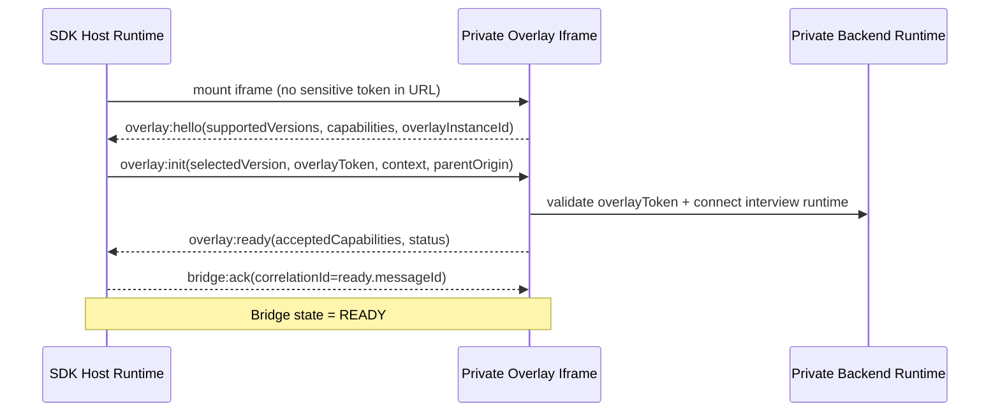

# Overlay Bridge Protocol v1 Specification

| Metadata         | Details                                     |
| :--------------- | :------------------------------------------ |
| **Name**         | `insightfull.overlay-bridge`                |
| **Version**      | `1.0`                                       |
| **Status**       | Draft                                       |
| **Primary Repo** | `github.com/insightfullai/web-research-sdk` |
| **Owners**       | SDK Team + Private Overlay Team             |

---

## 1) Purpose

Define the canonical integration protocol between:

1. **OSS SDK host runtime** (`@insightfull/web-research-sdk`)
2. **Private hosted overlay iframe app** (Insightfull-owned, proprietary)

This protocol is the **single integration seam** for interview/agent functionality in live website studies.

### 1.1 Why this exists

- Keep proprietary interview core logic private.
- Keep SDK open-source and easy to integrate.
- Ensure secure, reliable cross-origin communication.

### 1.2 Non-goals

- Not a public API for third-party overlay providers.
- Not a replacement for backend token/session contracts.
- Not a transport for raw behavioral event streams (SDK sends those directly to ingestion APIs).

---

## 2) Ownership Boundary

## 2.1 OSS SDK owns

- Overlay host container behavior (mount, position, drag/minimize, pass-through toggles)
- Iframe lifecycle
- Bridge transport + protocol validation
- Session/task/navigation context forwarding to overlay

## 2.2 Private overlay app owns

- Interview core logic and prompt orchestration
- Persona behavior and moderation intelligence
- Realtime media and proprietary UI internals

## 2.3 Private backend owns

- Overlay token issuance/validation
- Interview runtime connectivity
- Session authority and policy decisions

---

## 3) Normative Language

The key words **MUST**, **MUST NOT**, **SHOULD**, **SHOULD NOT**, and **MAY** are to be interpreted as RFC 2119 terms.

---

## 4) Security Invariants

1. SDK MUST only accept messages from configured `iframeOrigin`.
2. Overlay iframe MUST only post to explicit `parentOrigin` from `overlay:init`.
3. `targetOrigin='*'` MUST NOT be used in production.
4. Launch/session/overlay tokens MUST NOT be included in URL query params.
5. Overlay auth token MUST be scoped to overlay runtime actions only.
6. Unknown message types MUST be rejected (or ignored with explicit diagnostic) and never executed.
7. Payloads MUST pass runtime schema validation before handling.

---

## 5) Embedding & Transport

## 5.1 Base transport

- `window.postMessage` between parent (SDK host page) and child (overlay iframe).

## 5.2 Iframe creation requirements

SDK MUST create iframe with:

- `src`: provided by `session/start` (no sensitive query params)
- `sandbox`: minimum
  - `allow-scripts`
  - `allow-same-origin`
  - `allow-forms`
  - `allow-popups` (if needed by overlay auth UX)
- `allow`: least privilege; include only needed permissions
  - `microphone; camera; autoplay` (if enabled)
- `referrerpolicy="strict-origin-when-cross-origin"`

## 5.3 CSP requirements

- Host page MUST allow `frame-src`/`child-src` for overlay origin.
- Overlay app MUST allow expected host origins via `frame-ancestors`.

---

## 6) Versioning & Capability Negotiation

## 6.1 Version policy

- Protocol versions are `MAJOR.MINOR` strings.
- v1 supports `"1.0"` only.

Rules:

- Minor additions MUST be backward-compatible.
- Breaking changes require major bump (`2.0`).

## 6.2 Capability negotiation

Capabilities are feature flags for optional behavior.

Initial capability enum:

- `agent_audio`
- `agent_video`
- `pointer_passthrough`
- `task_prompts`
- `dynamic_overlay_resize`
- `token_refresh`

Handshake chooses the intersection of:

- SDK-supported capabilities
- Overlay-supported capabilities
- Backend-authorized capabilities (from `session/start`)

---

## 7) Envelope Schema

All messages MUST use this envelope.

```ts
type BridgeNamespace = "insightfull.overlay-bridge";
type BridgeVersion = "1.0";

interface BridgeEnvelope<TType extends string, TPayload> {
  namespace: BridgeNamespace;
  version: BridgeVersion;
  type: TType;
  messageId: string; // UUID v7 recommended
  sequence: number; // per-sender monotonic
  sentAtMs: number;
  sessionId: string;
  bridgeInstanceId: string; // SDK instance
  overlayInstanceId?: string; // required after hello
  correlationId?: string; // for replies/acks
  requiresAck?: boolean;
  payload: TPayload;
}
```

Validation rules:

- `namespace`, `version`, `type`, `messageId`, `sessionId`, and `payload` are required.
- `messageId` MUST be globally unique per sender.
- `sequence` MUST be strictly increasing per sender instance.

---

## 8) Lifecycle State Machines

## 8.1 SDK-side states

- `UNMOUNTED`
- `IFRAME_LOADING`
- `HANDSHAKE_PENDING`
- `READY`
- `DEGRADED`
- `TERMINATED`

## 8.2 Overlay-side states

- `BOOTING`
- `HELLO_SENT`
- `INIT_RECEIVED`
- `READY`
- `RECOVERING`
- `CLOSED`

State transitions MUST be emitted as diagnostics.

---

## 9) Handshake Flow (v1)



Timeouts:

- If `overlay:hello` not received within 5s: SDK enters `DEGRADED`.
- If `overlay:ready` not received within 5s of `overlay:init`: SDK retries `overlay:init` up to 2 times, then `DEGRADED`.

---

## 10) Message Catalog

## 10.1 SDK -> Overlay

### `overlay:init` (requiresAck = true)

Purpose: initialize overlay session.

```ts
{
  selectedVersion: "1.0";
  parentOrigin: string;
  overlayToken: string;
  overlayTokenExpiresAt: string;
  selectedCapabilities: string[];
  context: {
    organizationId: number;
    studyId: number;
    sectionId: number;
    sessionId: string;
    participantId?: string;
    tabId: string;
  };
  uiConfig: {
    defaultPosition: "bottom-right" | "bottom-left";
    showAiPersona: boolean;
    theme?: "light" | "dark" | "system";
  };
  consent: {
    mode: "required" | "best_effort" | "off";
    captureAllowed: boolean;
  };
}
```

### `overlay:task_update` (requiresAck = true)

```ts
{
  activeTaskId: string | null;
  tasks: Array<{
    id: string;
    status: "pending" | "active" | "completed" | "abandoned";
    instruction: string;
    maxDurationSeconds?: number;
  }>;
}
```

### `overlay:navigation_context` (requiresAck = false)

```ts
{
  pageUrl: string; // query sanitized by SDK policy
  pagePath: string;
  routeType: "history" | "hash" | "full_reload";
  timestampMs: number;
}
```

### `overlay:session_state` (requiresAck = true)

```ts
{
  state: "active" | "paused" | "ending" | "ended" | "degraded";
  reason?: string;
}
```

### `overlay:token_refresh` (requiresAck = true)

```ts
{
  overlayToken: string;
  overlayTokenExpiresAt: string;
}
```

### `overlay:shutdown` (requiresAck = true)

```ts
{
  reason: "session_ended" | "security_violation" | "manual_teardown" | "fatal_error";
}
```

## 10.2 Overlay -> SDK

### `overlay:hello` (requiresAck = true)

```ts
{
  overlayInstanceId: string;
  supportedVersions: Array<"1.0">;
  capabilities: string[];
  overlayBuild: string;
}
```

### `overlay:ready` (requiresAck = true)

```ts
{
  overlayInstanceId: string;
  acceptedCapabilities: string[];
  media: {
    audioReady: boolean;
    videoReady: boolean;
  };
}
```

### `overlay:ui_command` (requiresAck = true)

Whitelisted commands only:

```ts
{
  command:
    | "request_minimize"
    | "request_expand"
    | "set_pointer_passthrough"
    | "focus_overlay"
    | "set_overlay_size_hint";
  args?: Record<string, unknown>;
}
```

### `overlay:session_action` (requiresAck = true)

```ts
{
  action:
    | "end_session"
    | "pause_capture"
    | "resume_capture"
    | "task_complete"
    | "task_abandon";
  taskId?: string;
  reason?: string;
}
```

### `overlay:token_refresh_request` (requiresAck = true)

```ts
{
  reason: "expiring" | "backend_reconnect";
  expiresAt: string;
}
```

### `overlay:diagnostic` (requiresAck = false)

```ts
{
  level: "info" | "warn" | "error";
  code: string;
  message: string;
  details?: Record<string, unknown>;
}
```

### `overlay:error` (requiresAck = false)

```ts
{
  code: string;
  message: string;
  retryable: boolean;
  fatal: boolean;
}
```

## 10.3 Generic bridge messages

### `bridge:ack`

```ts
{
  ackMessageId: string;
  status: "ok";
}
```

### `bridge:nack`

```ts
{
  ackMessageId: string;
  status: "rejected";
  code: string;
  message: string;
  retryable: boolean;
}
```

### `bridge:ping` / `bridge:pong`

Used for liveness monitoring when needed.

---

## 11) Reliability Semantics

1. Messages with `requiresAck=true` MUST be retried if not acked.
2. Retry policy (default):
   - timeout: 1500ms
   - max retries: 2
   - backoff: 300ms, then 800ms
3. Receivers MUST dedupe by `messageId`.
4. Duplicate messages MUST return the same ack/nack decision.
5. Out-of-order messages SHOULD be tolerated unless command semantics require ordering.
6. If critical command repeatedly fails, SDK MUST enter `DEGRADED` and log diagnostics.

---

## 12) Error Codes

Minimum code set:

- `BRG_ORIGIN_MISMATCH`
- `BRG_PROTOCOL_VERSION_UNSUPPORTED`
- `BRG_SCHEMA_INVALID`
- `BRG_UNKNOWN_MESSAGE_TYPE`
- `BRG_ACK_TIMEOUT`
- `BRG_OVERLAY_TOKEN_EXPIRED`
- `BRG_OVERLAY_TOKEN_INVALID`
- `BRG_IFRAME_UNAVAILABLE`
- `BRG_IFRAME_BLOCKED_BY_CSP`
- `BRG_COMMAND_NOT_ALLOWED`
- `BRG_RATE_LIMITED`
- `BRG_INTERNAL_ERROR`

Error handling rules:

- Security-related errors (`ORIGIN_MISMATCH`, `TOKEN_INVALID`) MUST trigger immediate bridge shutdown.
- Recoverable errors (`ACK_TIMEOUT`, `RATE_LIMITED`) SHOULD trigger bounded retries.

---

## 13) Privacy & Data Minimization

The bridge MUST NOT carry:

- raw input field values
- unredacted DOM text
- sensitive auth credentials beyond scoped overlay token

The bridge MAY carry:

- task metadata
- route/path context (query redacted by allowlist)
- high-level session state

URL policy:

- Query parameters MUST be stripped by default.
- Optional allowlist can preserve specific non-sensitive keys.

---

## 14) Performance Constraints

- Max bridge payload size: 32KB/message
- Recommended max bridge message rate: 30 msg/sec total
- Diagnostics SHOULD be throttled (1/sec per code)
- UI command burst protection SHOULD be applied in SDK to avoid feedback loops

---

## 15) Degraded Mode Behavior

If overlay fails but SDK capture remains healthy:

1. SDK enters `DEGRADED`.
2. SDK keeps behavior capture + ingestion active.
3. SDK displays minimal participant fallback (“guided overlay unavailable”).
4. SDK emits `overlay_unavailable` diagnostics to backend.
5. Researcher UI surfaces warning so analysis context is explicit.

If bridge recovers, SDK MAY return to `READY` after successful re-handshake.

---

## 16) Multi-tab / Microfrontend / Lifecycle Edge Cases

## 16.1 Multi-tab

- `tabId` is included in `overlay:init` context.
- Backend SHOULD enforce token-session-tab consistency.
- If session already active in another tab, SDK SHOULD display deterministic conflict reason.

## 16.2 Microfrontend duplicate SDK instances

- SDK MUST use `InstanceGuard` (single active bridge per page/session).
- Non-owner instances MUST remain passive.

## 16.3 BFCache + page lifecycle

- On `pageshow` with `persisted=true`, SDK MUST revalidate bridge health.
- Duplicate listener attachment MUST be prevented.

---

## 17) Testing Requirements (Protocol-specific)

Required automated tests:

1. Schema contract tests for all message types
2. Origin validation tests (accept expected, reject all others)
3. Handshake timeout and retry tests
4. Dedupe tests for duplicate `messageId`
5. Unknown command/type rejection tests
6. Token refresh success/failure tests
7. Degraded mode activation and recovery tests
8. BFCache/mount-remount lifecycle tests
9. Multi-instance guard tests

Required E2E scenarios:

- Happy path with full handshake
- iframe blocked by CSP
- overlay token expires mid-session
- ad blocker/network interference
- auth redirect origin changes within allowlist

---

## 18) Release Checklist (Bridge v1)

- [ ] Protocol schemas published and version-tagged
- [ ] SDK + overlay app both pass protocol compatibility tests
- [ ] Security review signed off (origin validation + token scope)
- [ ] Degraded fallback UX verified
- [ ] Observability dashboards include bridge health metrics

---

## 19) Observability Requirements

Both SDK and private overlay app SHOULD emit:

- `bridge.handshake.started|succeeded|failed`
- `bridge.message.sent|acked|nacked|timed_out`
- `bridge.error.<code>`
- `bridge.degraded.entered|recovered`

Each event SHOULD include:

- `sessionId`
- `bridgeInstanceId`
- `overlayInstanceId`
- `protocolVersion`
- `sdkVersion` / `overlayBuild`

---

## 20) Open Questions (to resolve before finalizing v1)

1. Do we upgrade to `MessageChannel` after handshake for stronger channel isolation in v1 or v1.1?
2. Should `overlay:ui_command` include explicit signed intent from backend for sensitive actions (e.g. end session)?
3. Exact `frame-ancestors` policy strategy for customer-specific host origins at scale.
4. Final payload budget if richer overlay state sync is added.
