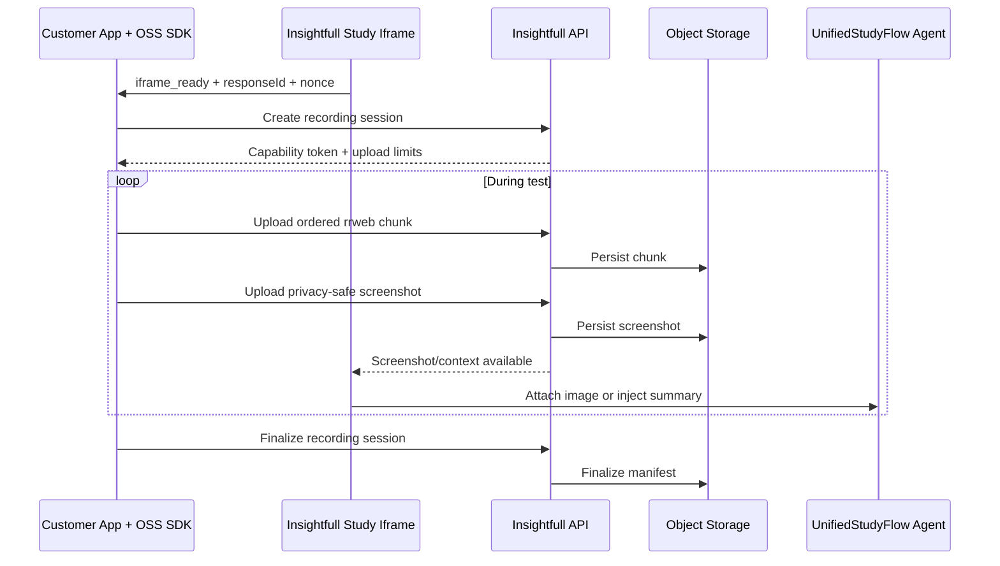

# Insightfull-Side Plan: Real-App Recording and Agent Screen Context

This document describes the recommended architecture and implementation direction for the engineer working in `../insightfull`. It is intentionally an overall direction rather than a final implementation specification. The engineer should validate the product model, naming, privacy policy, and existing domain ownership before implementation.

## 1. Target Architecture

Treat this as two separate data planes:

1. **Recording plane**
   - rrweb events captured in the customer application by the OSS SDK.
   - Persisted for later researcher replay.
   - Uploaded in ordered, idempotent chunks.

2. **Agent context plane**
   - Periodic screenshots and/or privacy-safe screen summaries.
   - Delivered to UnifiedStudyFlow during the interview.
   - Screenshots require a real vision-capable agent path; rrweb events alone do not let the agent see the screen.



Do not send raw rrweb snapshots directly into the LLM context. They are large, noisy, and are not images.

## 2. Product Contract to Resolve First

Before backend work, decide:

- Is this an AI interview augmented with live application context, or a new `real_app_test` section type?
- Is screenshot/vision required for the first release?
- What exact consent and masking defaults are required?
- What ends the real-app task?
- Should partial recordings appear when participants abandon the study?
- How long are recordings and screenshots retained?

Recommended initial direction:

- Augment the existing UnifiedStudyFlow rather than creating a parallel orchestration system.
- Make recording explicitly enabled per study.
- Treat screenshots/vision as required if the product promise is that the agent can see the application.
- Allow recording failures to degrade gracefully rather than preventing interview completion.

## 3. Fix Identity and Session Linkage

The recording must be linked to a real response before capture begins.

Required identifiers:

- Public SDK `clientId`
- Numeric SDK environment ID, resolved server-side
- `studyId`
- `responseId` / `study_responses_base.id`
- Optional `sectionResponseId`
- Client-generated `recordingSessionId`
- Unified agent `correlationId`, resolved server-side when possible

### Required bridge change

After `initializeSdkResponse`, the iframe should send the host:

```ts
{
  type: "insightfull.recording_context";
  nonce: string;
  studyId: number;
  responseId: number;
  sectionResponseId?: number;
}
```

Alternatively, include these fields in `insightfull.iframe_ready`.

The host recorder should not create an upload session until this message arrives.

Also fix the existing-response behavior in `initializeSdkResponse`: reused responses currently return `sections: []`. Load and return the real section responses.

## 4. Add a Dedicated Backend Domain

Recommended library:

```text
libs/real-app-recordings/
```

Use the standard backend-domain layout:

```text
src/lib/
  repositories/
    interfaces.ts
    recording-session-repository.ts
    recording-chunk-repository.ts
    recording-image-repository.ts
  services/
    recording-authorization.service.ts
    recording-storage.service.ts
    recording-context.service.ts
  routers/
    create-recording-session.trpc.ts
    upload-recording-chunk.trpc.ts
    upload-recording-image.trpc.ts
    finalize-recording-session.trpc.ts
    get-recording-manifest.trpc.ts
  tasks/
    cleanup-expired-recordings.task.ts
  types/
    domain.types.ts
```

Keep the implementation out of `sdk-management`. That library can expose or compose the public routes, but should not become a recording-storage subsystem.

## 5. Persistence Model

### `real_app_recording_sessions`

Suggested fields:

- ID and globally unique `recordingSessionId`
- Organization, SDK environment, study, and response foreign keys
- Optional section response and unified correlation IDs
- Bound origin hostname
- Status:
  - `created`
  - `recording`
  - `finalizing`
  - `completed`
  - `partial`
  - `failed`
  - `expired`
- SDK, recorder, and recording-format versions
- Privacy/masking configuration snapshot
- Capability-token hash and expiration
- Start/end timestamps and stop reason
- Total chunks, images, bytes, and events
- Retention expiration

### `real_app_recording_chunks`

- Session foreign key
- Sequence number
- Time range
- Event count and byte size
- SHA-256 checksum
- Object-storage key
- Status
- Unique constraint on `(sessionId, sequence)`

### `real_app_recording_images`

- Session foreign key
- Sequence or capture timestamp
- MIME type, dimensions, and byte size
- Checksum and storage key
- Masking/privacy metadata
- Whether the image was exposed to the agent
- Optional agent turn/correlation reference

Store large payloads in object storage, not Postgres. Generate schema migrations through the repository's Drizzle workflow rather than writing migrations manually.

## 6. Participant Upload APIs

Expose the participant-facing operations through the public SDK surface while implementing their business logic in the new recording domain.

### Create session

Validate:

1. SDK environment and embedding origin.
2. Study is live, enabled for real-app recording, and belongs to the environment.
3. Response belongs to the same study and organization.
4. Response SDK metadata matches the environment and participant.
5. Optional section response belongs to the response.
6. Requested privacy settings do not exceed server-approved settings.

Return:

- Recording session ID
- Short-lived capability token
- Maximum duration, chunk size, image size, total bytes, and event count
- Screenshot cadence and permitted formats

### Upload rrweb chunk

Requirements:

- Capability-token validation
- Bound-origin validation
- Stable sequence number
- Client and server checksum validation
- Strict body-size and event-count limits
- Idempotency:
  - Same sequence and checksum: success
  - Same sequence with a different checksum: conflict

For v1, upload through the Insightfull API and let the server write to S3. Existing production S3 CORS only permits the Insightfull frontend origin, so direct upload from arbitrary customer domains is not currently viable.

### Upload screenshot

Prefer binary upload rather than embedding large base64 data in tRPC JSON.

Validate:

- Capability and origin
- MIME type and decoded file size
- Dimensions
- Capture rate
- Session totals
- Study privacy policy

The engineer should decide whether this is a focused REST endpoint or a route-specific multipart endpoint. A REST endpoint may also be better for unload/beacon delivery.

### Finalize session

Finalization must be idempotent and accept:

- Stop reason
- Expected final sequence
- Final event/chunk/image counts
- Final byte count
- End timestamp

Missing chunks should result in `partial`; they should not cause participant study completion to fail.

## 7. Authorization and Security

Do not copy the existing public participant pattern that authorizes mutations using numeric response IDs alone.

Create a capability token only after validating:

- SDK environment
- Origin
- Study
- Response
- SDK attribution
- Participant identity

Store only the SHA-256 hash and compare it timing-safely, following the existing multipart capability-token pattern.

Additional requirements:

- Per-session and per-environment rate limits
- Strict maximum session size and duration
- Server-side privacy-policy enforcement
- Password, payment, and sensitive-field masking enabled by default
- Route allow/deny rules
- No raw participant identifiers in object-storage keys
- Audit researcher access when practical

A non-empty SDK domain allowlist should probably be mandatory before enabling recording.

## 8. Main-App Bridge Integration

Create a focused React library such as:

```text
libs/real-app-recording-react/
```

Wire it into `UnifiedStudyFlow.tsx` in `libs/multi-section-flow`.

The iframe bridge must:

- Read the bridge nonce from launch context.
- Send readiness/context messages to the exact parent origin.
- Require `event.source === window.parent`.
- Validate origin, nonce, protocol version, study, and response.
- Buffer a bounded number of messages while UnifiedStudyFlow connects.
- Preserve bridge context across the route transition that adds the response ID.

### Live event policy

Use rrweb for archival replay, but send only summarized activity to the agent:

- Navigation: silent context
- Meaningful click: silent context
- Repeated ineffective clicks: prompted context after a cooldown
- Masked field changed: summary only, never the value
- Task completion: prompted context
- Scroll and resize: aggregate or discard
- Full snapshots and mutation snapshots: replay only

Reuse the existing UnifiedStudyFlow context injection and prototype-activity patterns rather than creating a second agent session.

## 9. Add Actual Vision Support

This is a separate cross-cutting feature. The current UnifiedStudyFlow transport accepts text only and advertises no video support.

A proper screenshot path must extend:

- Unified session hook contract
- `SessionCoordinator`
- Realtime and text transport adapters
- Agent turn/request schemas
- Provider/model capability selection
- Token and cost accounting
- Attachment retention and audit behavior

Suggested API shape:

```ts
injectContextAttachment({
  text: "Current participant application screen",
  image: {
    storageId: "...",
    mimeType: "image/webp",
  },
  requestResponse: false,
});
```

The backend should generate a short-lived signed URL or retrieve the image server-side while constructing the model request. Avoid placing long-lived public URLs into agent context.

If this attachment work is not implemented, describe the first release as using interaction summaries rather than claiming the agent can see the screen.

### Screenshot capture warning

Capturing arbitrary customer pages is technically and privacy-sensitive:

- Cross-origin assets can taint browser canvas rendering.
- Browser APIs do not provide silent full-page screenshots.
- `html2canvas`-style approaches will not perfectly reproduce every page.
- Input fields and sensitive elements must be masked before capture.

The Insightfull engineer should validate the host-side capture approach with the SDK engineer before committing to vision scope.

## 10. Researcher Replay

Add authenticated APIs that:

- Resolve the recording's organization server-side.
- Run `checkOrganizationAccess`.
- Return the recording manifest.
- Return short-lived signed URLs for ordered chunks and images.

Do not overload the existing single-video `getMediaAccess` contract.

Later, add an rrweb player to the study response/transcript area. Keep `rrweb-player` in the researcher-facing frontend library rather than the SDK or global application bundle.

The UI must represent:

- Recording available
- Partial recording
- Upload failed
- Recording disabled
- Expired or deleted recording

## 11. Retention and Deletion

Implement retention as part of the initial backend work:

- `expiresAt` on every recording session
- Graphile Worker cleanup task
- Scheduled cleanup registration
- S3 object deletion followed by database cleanup
- Recording cleanup when a study response is deleted
- S3 lifecycle rules for the recording prefix
- Noncurrent-version lifecycle handling because the bucket uses versioning

Retention duration requires a product/legal decision.

## 12. Resolve the Duplicate SDK Problem

`../insightfull` currently aliases `@insightfull/web-research-sdk` to an internal copy under `libs/web-research-sdk`. That copy does not contain the new OSS bridge/recorder implementation.

Before claiming end-to-end support:

1. Consume the OSS package through the documented tarball/local-integration flow.
2. Update the dogfood harness to use that package.
3. Retire the internal copy or establish one clearly canonical source.
4. Ensure tests do not silently exercise the wrong SDK implementation.

## 13. Recommended Delivery Sequence

### Phase 1: Contracts and security

- Decide the actual-app section/product model.
- Define the response-context bridge protocol.
- Define privacy and consent policy.
- Define the capability-token model.
- Resolve OSS versus internal SDK consumption.

### Phase 2: Recording persistence

- Add schema and migrations.
- Implement recording domain services and repositories.
- Implement create, chunk, image, and finalize APIs.
- Add CORS, rate limits, idempotency, and storage.
- Add retention worker.

### Phase 3: Main-app bridge

- Add iframe readiness/context response.
- Validate incoming host messages.
- Persist and forward safe live context.
- Connect text summaries to UnifiedStudyFlow.

### Phase 4: Vision

- Add screenshot attachment contracts.
- Extend both agent transports.
- Enforce provider/model capability.
- Add cost, privacy, and failure telemetry.

### Phase 5: Researcher experience

- Add manifest access.
- Add rrweb replay.
- Show uploaded screenshots where useful.
- Support partial and expired states.

### Phase 6: Dogfood and rollout

- Exercise the actual OSS SDK package.
- Enable only for internal dogfood.
- Add end-to-end tests.
- Roll out behind study-level configuration, default off.

## 14. Required Validation

At minimum:

- Repository integration tests for tenant and response ownership
- Service tests for capability expiry, limits, and idempotency
- Router schema and authorization tests
- Upload retry and duplicate-sequence tests
- Cross-origin browser tests with allowed and denied hosts
- Bridge origin/source/nonce rejection tests
- UnifiedStudyFlow test proving live context reaches the agent
- Vision test proving the model receives an actual image attachment
- Replay test proving chunk order and partial-session behavior
- Cleanup test proving database and S3 objects are deleted
- Full dogfood flow using the OSS package, not the internal alias

Run the relevant Nx tests and typechecks, and regenerate `server-types` after tRPC changes.

## 15. High-Risk Items to Escalate

1. **Agent vision does not exist today.**
2. **Response IDs are not yet reliably propagated to the host recorder.**
3. **Current public participant endpoints are not a safe authorization model for recordings.**
4. **Production S3 CORS does not support direct uploads from customer origins.**
5. **Insightfull may be testing an outdated internal SDK copy.**
6. **Arbitrary webpage screenshot capture requires a feasibility and privacy spike.**

## 16. Owner Decisions Required

1. Is an actual-app test an existing AI interview augmented with host context, a reuse of `prototype_test`, or a new section type?
2. Should host-side initialization replace iframe-side response initialization, or should a signed launch token carry validated host-origin proof into the iframe?
3. What is the canonical iframe-to-host response-context protocol?
4. Is a configured environment domain allowlist mandatory for recording?
5. What retention and deletion/legal-hold policies apply?
6. What are the maximum session duration, event count, total bytes, chunk bytes, and screenshot cadence?
7. Should raw visitor/user IDs be retained, hashed, or omitted?
8. Should partial recordings from early exits appear in researcher results?
9. Is text-only live context sufficient for beta, or is screenshot/vision a launch requirement?
10. Must final unload delivery use `sendBeacon`, and does that justify a dedicated REST endpoint?
11. Should recordings use the existing app-files bucket or a separate encrypted bucket/prefix?
12. Can the internal `libs/web-research-sdk` copy be retired in favor of the OSS package?
