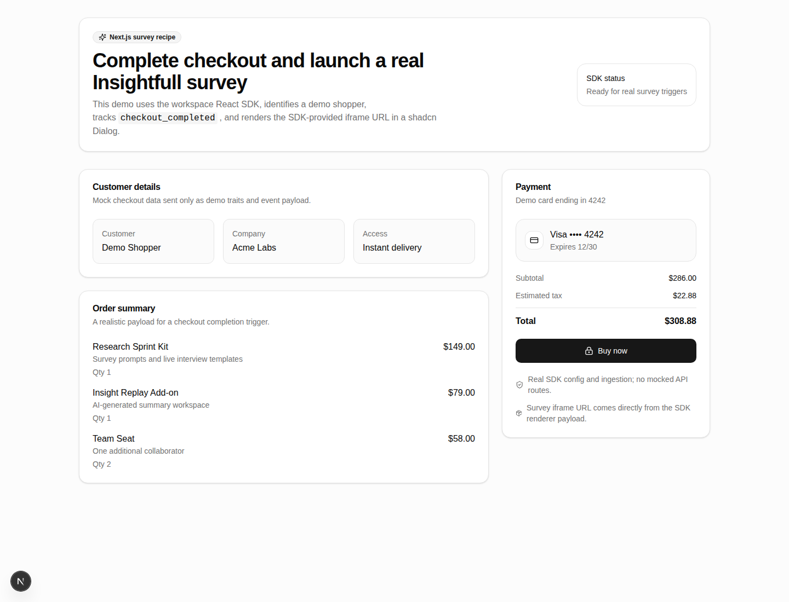
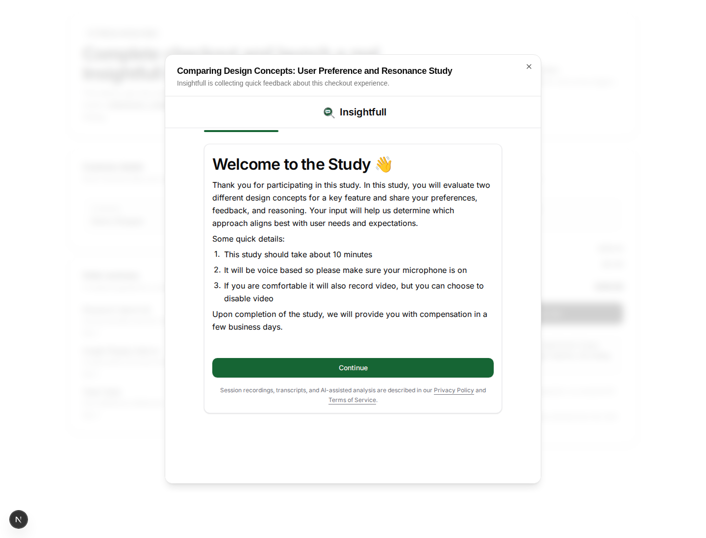

# Next App Survey Recipe

Private workspace recipe showing how to run a real Insightfull survey from a Next.js checkout flow and present the SDK iframe in a shadcn/ui `Dialog`.

## Real setup

1. In Insightfull, create or select an SDK environment.
2. Copy its public client ID.
3. Create a survey-mode study.
4. Add and activate a trigger for the event name `checkout_completed`.
5. If your environment enforces allowed domains, add your local app domain (for example `http://localhost:3000`).
6. Copy the example env file and set the client ID:

   ```bash
   cp packages/next-app-survey/.env.local.example packages/next-app-survey/.env.local
   ```

   ```dotenv
   NEXT_PUBLIC_INSIGHTFULL_CLIENT_ID=env_your_public_client_id
   ```

   Optional staging/local API base:

```dotenv
NEXT_PUBLIC_INSIGHTFULL_API_BASE=https://insightfull.ai
```

7. Install and run the app:

   ```bash
   yarn install
   yarn workspace next-app-survey dev
   ```

8. Open the local app, wait for **SDK status** to show ready, and click **Buy now**.

The app identifies a demo user and tracks:

```ts
sdk.track("checkout_completed", {
  total: 309.88,
  currency: "USD",
  itemCount: 4,
  checkoutType: "demo",
  paymentMethod: "card",
  shippingTier: "instant_access",
});
```

If the environment has an active matching survey trigger, the SDK custom renderer receives the generated `iframeUrl`; this recipe renders that exact URL inside a shadcn Dialog. The app does not reconstruct iframe URLs and does not mock Insightfull config or ingestion routes.

## Screenshots

Checkout page before purchase:



Custom survey Dialog opened after clicking **Buy now**:



## Verification

```bash
yarn workspace next-app-survey build
yarn check
```

If `NEXT_PUBLIC_INSIGHTFULL_CLIENT_ID` is missing, the checkout page shows a setup callout and disables **Buy now** rather than pretending a survey is configured.
